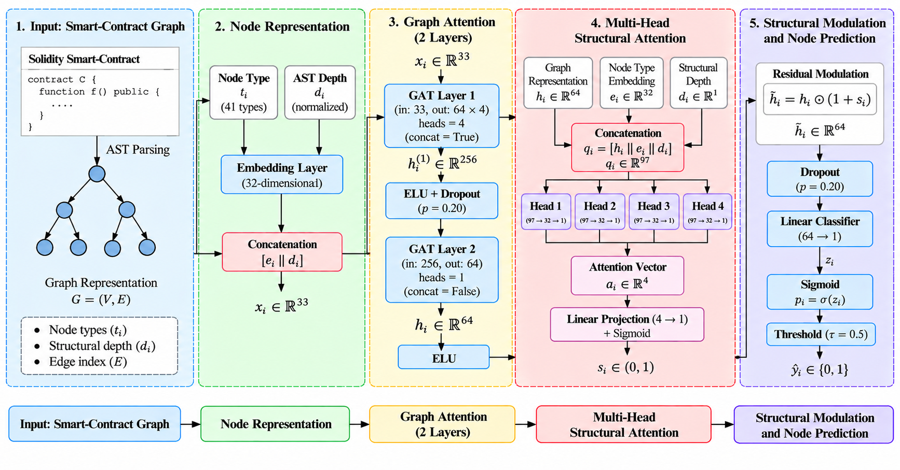

<div align="center">

# 🛡️ SecureGAT-MSA

### Multi-Head Structural Attention Graph Learning for Smart Contract Vulnerability Detection

*Node-level vulnerability detection and localization in Solidity smart contracts*

<br>


[Overview](#-overview) •
[Architecture](#-model-architecture) •
[Results](#-performance) •
[Installation](#-installation) •
[Usage](#-usage) •
[Citation](#-citation)

</div>

---

## 📖 Overview

SecureGAT-MSA is a graph-based deep learning framework for **vulnerability detection and localization** in Solidity smart contracts. Contracts are represented as structural graphs, and the model combines **Graph Attention Networks (GATs)** with **Multi-Head Structural Attention** to capture both local graph dependencies and multi-scale structural patterns. It then performs **node-level** vulnerability prediction from the learned graph representations.

### ❓ Why this project?

Smart contract vulnerabilities are a critical security concern because blockchain applications are decentralized and irreversible: once deployed, a flawed contract is very hard to fix. Existing machine learning approaches often rely on handcrafted features or sequential representations, which can overlook the structural relationships between program components.

### 💡 Our approach

| | Contribution |
|:-:|---|
| 🕸️ | Constructs **structural smart contract graphs** from Solidity program representations |
| 🎯 | Learns node representations with **Graph Attention Networks** |
| 🧠 | Introduces **Multi-Head Structural Attention** to capture diverse structural dependencies |
| 📍 | Predicts vulnerabilities at the **node level** for fine-grained localization |

---

## 🏗️ Model Architecture

<div align="center">



<sub><b>Figure 1.</b> Overview of the SecureGAT-MSA architecture.</sub>

</div>

| Stage | Component | Description |
|:-:|---|---|
| **1** | 🕸️ **Input: Smart-Contract Graph** | Solidity code is parsed into an AST graph `G = (V, E)` with node types, structural depth, and an edge index. |
| **2** | 🔢 **Node Representation** | Node type (41 types) is embedded into 32 dimensions and concatenated with the normalized AST depth, giving `x_i ∈ ℝ³³`. |
| **3** | 🎯 **Graph Attention (2 layers)** | GAT Layer 1 uses 4 heads (concat, 64 × 4 = 256), followed by ELU and dropout. GAT Layer 2 uses 1 head and outputs `h_i ∈ ℝ⁶⁴`. |
| **4** | 🧠 **Multi-Head Structural Attention** | `q_i = [h_i ‖ e_i ‖ d_i] ∈ ℝ⁹⁷` feeds 4 heads (97 → 32 → 1). Their outputs form `a_i ∈ ℝ⁴`, projected to a structural score `s_i ∈ (0, 1)`. |
| **5** | ✅ **Structural Modulation & Node Prediction** | Residual modulation `h̃_i = h_i ⊙ (1 + s_i)`, dropout (p = 0.20), a linear classifier (64 → 1), sigmoid, and a threshold of τ = 0.5 give `ŷ_i ∈ {0, 1}`. |

---|---|
| **1** | 🕸️ **Smart Contract Graph Representation** | Solidity contracts are transformed into structural graphs. Nodes represent program components; edges represent structural relationships. |
| **2** | 🔢 **Structural Node Representation** | Node attributes are embedded into continuous feature representations. |
| **3** | 🎯 **Graph Attention Layers** | GATs learn neighborhood-aware node representations. |
| **4** | 🧠 **Multi-Head Structural Attention** | Multiple attention heads capture different structural patterns. |
| **5** | ✅ **Node-Level Vulnerability Prediction** | A classifier labels each node as vulnerable or non-vulnerable. |

---

## 🧪 Experimental Protocol

Evaluation uses a **contract-level split** to prevent information leakage between training and evaluation data.

| Split | Number of Graphs |
|:------|-----------------:|
| 🟦 Training | 245 |
| 🟨 Validation | 49 |
| 🟥 Testing | 56 |
| **Total** | **350** |

---

## 📊 Performance

Results on the held-out test set:

| Metric | Score |
|:-------|------:|
| Accuracy | **0.8817** |
| Precision | 0.6850 |
| Recall | 0.7252 |
| F1-score | 0.7045 |
| ROC-AUC | **0.9384** |
| PR-AUC | 0.7511 |

> [!NOTE]
> Vulnerable nodes are the minority class, so Precision, Recall, F1 and PR-AUC are more informative than Accuracy alone.

---

## ⚙️ Installation

**1. Clone the repository**

```bash
git clone https://github.com/willie-willie/SecureGAT-MSA.git
cd SecureGAT-MSA
```

**2. Create a Python environment**

```bash
conda create -n securegat python=3.10
conda activate securegat
```

**3. Install dependencies**

```bash
pip install -r requirements.txt
```

<details>
<summary><b>📦 Main dependencies</b></summary>

<br>

| Package | Version | Purpose |
|---|---|---|
| `tensorflow` | 2.15.0 | Deep learning backend |
| `spektral` | 1.3.1 | Graph neural network layers |
| `numpy` | 1.26.4 | Numerical computing |
| `pandas` | 2.1.4 | Data handling |
| `scikit-learn` | 1.3.2 | Metrics and evaluation |
| `networkx` | 3.2.1 | Graph construction and analysis |
| `matplotlib` | 3.8.2 | Visualization |
| `tqdm` | 4.66.1 | Progress bars |
| `py-solc-x` | 2.0.3 | Solidity compiler management |

</details>

---

## 🚀 Usage

```bash
# Train the model
python -m py_compile Model/train_securegat_msa.py
python Model/train_securegat_msa.py

# Evaluate on the test set
python -m py_compile Model/evaluate_securegat_msa.py
python Model/evaluate_securegat_msa.py
```

---

## 📁 Repository Structure

> Adjust to match your repository.

```text
SecureGAT-MSA/
├── dataset/               # Smart contract dataset and graphs
├── Model/             # SecureGAT-MSA model definition
├── Preprocessing/          # Data preprocessing
├── requirements.txt    # Python dependencies
└── README.md
```

---

## 📚 Citation

If you use this work in your research, please cite:

```bibtex
@misc{securegatmsa,
  title  = {SecureGAT-MSA: Multi-Head Structural Attention Graph Learning for Smart Contract Vulnerability Detection},
  author = {Bole Wilfried Tienin},
  year   = {2026},
  url    = {https://github.com/willie-willie/SecureGAT-MSA}
}
```

---

## 📄 License

This project is released under the MIT License. See [LICENSE](LICENSE) for details.

---

<div align="center">

⭐ If you find this project useful, please consider giving it a star!

</div>
